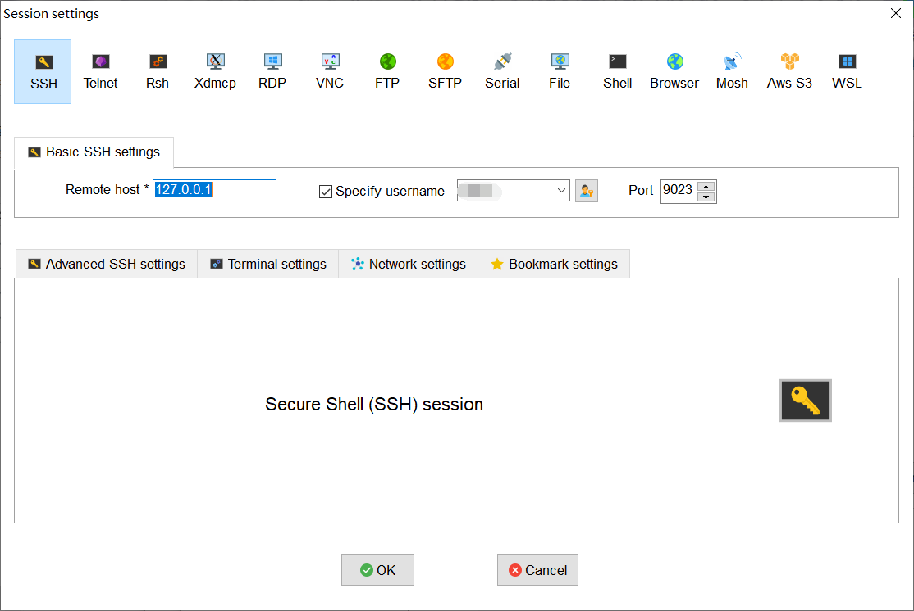
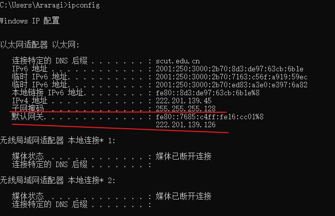
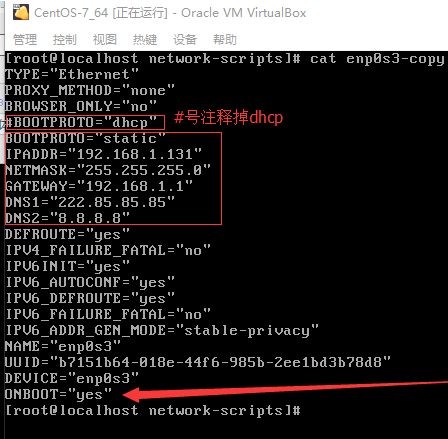
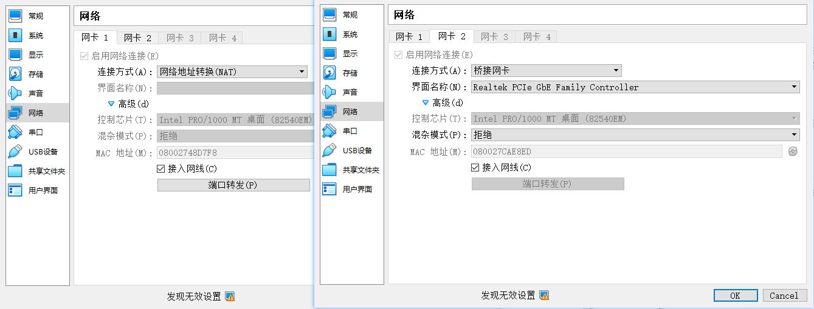
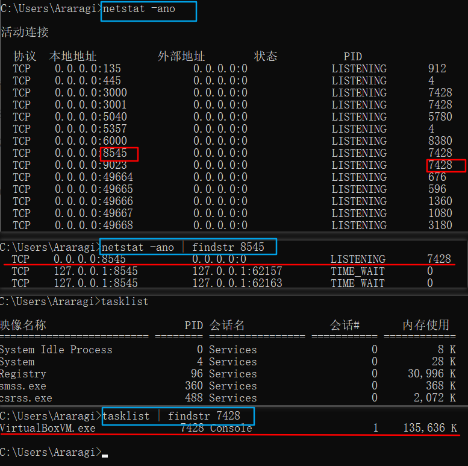
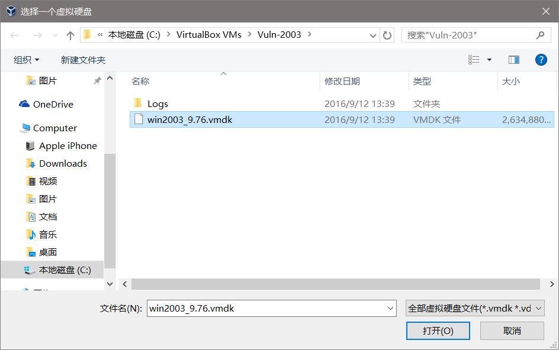
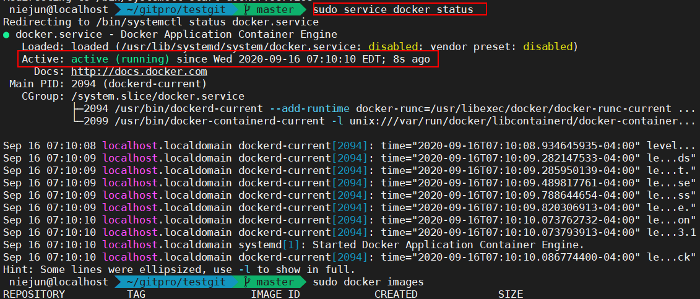
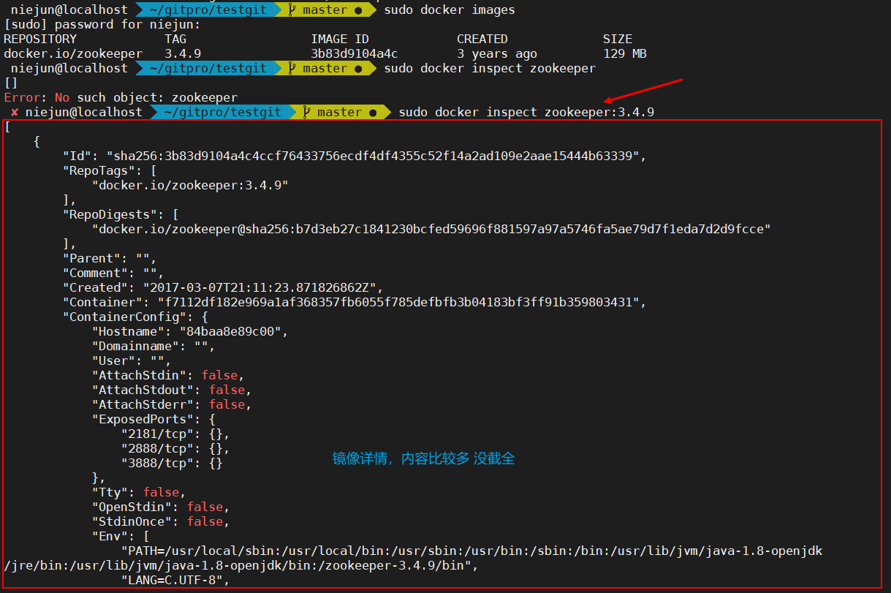
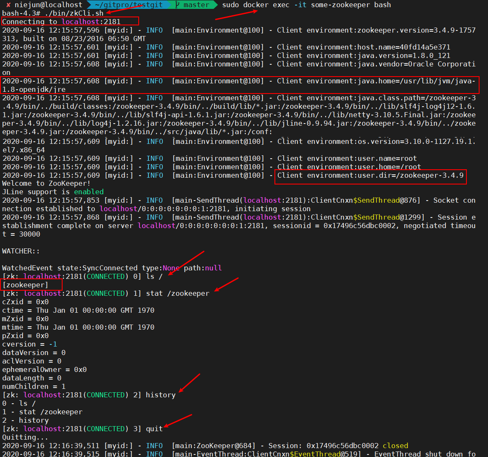
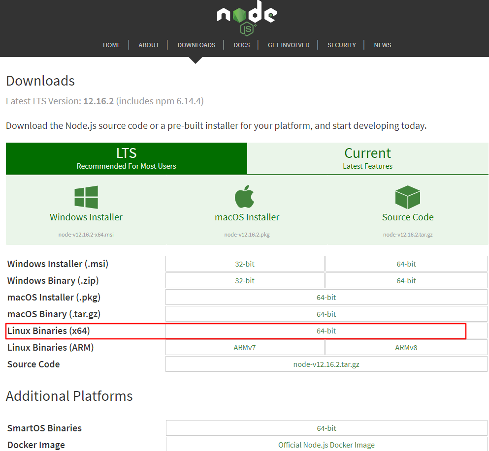

# 如何连接 VB里的centos

## wifi模式下推荐使用(NAT)

简单可行，只需配置virtualbox:

> 右键选择 ***VirtualBox6.1.4*** 里的Linux，我这里是以centos7为例子。 右键->设置->网络 连接方式选择 ：网络地址转换（NAT） 然后点高级->端口转发， 如图配置即可： 
>
> 
>
> 端口转发设置非常重要，shell连接本地ip上的9023端口，即可转发到虚拟机里的22端口。 主机端口和子系统端口可自己定义，根据实际需求设置。
>
> ***MobaXterm V20.1***  下ssh连接设置如下
>
> 
>
> 这样配置后，会通过ssh连接上本地虚拟机，并进入 配置的特定用户目录下

## 虚拟机的四种网络连接方式

|                   | NAT  | Bridged Adapter |   Internal   | Host-only Adapter |
| :---------------: | ---- | :-------------: | :----------: | :---------------: |
|   虚拟机 → 主机   | √    |        √        |      ×       | 默认不能，需设置  |
|   主机 → 虚拟机   | ×    |        √        |      ×       | 默认不能，需设置  |
| 虚拟机 → 其他主机 | √    |        √        |      ×       | 默认不能，需设置  |
| 其他主机 → 虚拟机 | ×    |        √        |      ×       | 默认不能，需设置  |
|    虚拟机之间     | ×    |        √        | 同网段名可以 |         √         |

PS：若宿主机连的是**wifi**，虚拟机要想访问外网，xshell连上虚拟机，虚拟机的网络连接必须设置为 "网络地址转换(NAT)"，此模式相当于宿主机的一个应用，**用的ip地址是宿主机的**。且NAT模式下所有的端口号要想宿主机、外网主机能访问到，必须在**端口转发中加上该端口**。

​		若宿主机插了网线，可以考虑使用桥接模式，此模式下**相当于与宿主机同网段的另一台主机**。

但此模式最好设置一个固定的ip地址否则每次dhcp自动分配，xshell连接和访问linux下的web应用都需要重新更改ip地址。

## 桥接模式下设置固定ip地址(网线)

> (连的wifi推荐使用 地址转换NAT，不需进行下列操作)
>
> 参考文章： [virtualBox装虚拟机能ping通baidu，但查不出ip，也不能连接xshell的解决办法](https://blog.csdn.net/qq_41063141/article/details/93885103)
>
> 1. 首先在宿主机上 查看当前连接网络的ipv4地址和默认网关（windows使用 ipconfig命令）
>
>    
>
> 2. 查看虚拟机启用的网卡和ip地址(Centos使用的是 **ip addr** 而不是 ifconfig)
>
> 
>
> 可以看到此处启用的网卡名是  enp0s3
>
> 3. 修改上面对应网卡的配置文件，这里是 /etc/sysconfig/network-scripts/ifcfg-enp0s3  修改后的配置文件如右图()
>
> 
>
> ​		把BOOTRPOTO修改成了static，是因为dhcp是自动获取，如果不改成static，我们在这里修改的这些地址不会生效，因为重启网络服务时，BOOTRPOTO的值决定了是自动分配还是使用静态数据，设置dns服务器
>
> 4. 重启网络  **sudo service network restart**
>
> 5. 经过上面操作后就可以 通过上面设置的静态ip地址 访问虚拟机里的web应用，xshell连接等。

## 配置双网卡 NAT+桥接(推荐)

参考文章： [virtualbox 最小化安装centos7 配置双网卡(nat和桥接)](https://blog.csdn.net/landebug/article/details/71107729?utm_source=blogxgwz0&utm_medium=distribute.pc_relevant.none-task-blog-title-7&spm=1001.2101.3001.4242)

> 为了能在宿主机使用 有线和wifi的情况下，虚拟机都能访问网络，推荐为虚拟机配置**双网卡([NAT模式](#wifi模式下推荐使用(NAT)) + [桥接模式](#桥接模式下设置固定ip地址(网线)))** 
>
> 
>
> PS: 一般虚拟机默认只有一张网卡，新建网卡 需要虚拟机处于关机模式

# windows如何查看端口是否被占用

> 进入命令窗口
>
> netstat -ano  # 列出所有端口情况，最后一列是占用该端口的进程id
>
> netstat -ano | findstr 8545  # 查看8545端口占用情况，无占用则输出空
>
> netstat -ano | findstr 7428  # 查看进程id为7428的进程信息，可以看到进程名
>
> 

# virtualbox相关操作

## VirtualBox导入VmWare生成的.vmdk格式虚拟机镜像

> 原文链接： [VirtualBox导入.vmdk虚拟机](https://blog.csdn.net/ArthurCaoMH/article/details/90274651)

VmWare默认的镜像格式是.vmdk格式的，VirtualBox则默认是.vdi格式的。其实这在VirtualBox新建虚拟机的过程中是可选的。

导入.vmdk格式的镜像到VirtualBox只需要新建一个虚拟机，并且不创建虚拟硬盘。如下图：


无视警告，继续：


创建好之后，在设置里面把.vmdk格式的虚拟硬盘添加进去：





这样就可以了。

如果遇到windows虚拟机起不开的情况，尝试更改下下面这个选项：
启用下I/O APIC试试。


### 删除载入的.vmdk虚拟机

由于.vmdk格式只包含原始系统镜像，运行时产生的文件是分开放的并非叠加到.vmdk，故只需移除运行时的文件，下回导入可同样使用该.vmdk  ，具体过程如图：


## virtualbox增强功能

> 原文链接： [VirtualBox共享解决和拖放不生效的问题](https://blog.csdn.net/ArthurCaoMH/article/details/90274651)

### 简介

- 主机系统：windows 10 x64位
- 虚拟机系统：windows 7 x32位

### 步骤

#### 一、设置

*注：按照下图所示进行设置*


#### 二、安装增强功能

注： 增强功能的安装是安装在虚拟机里面的*

1. 启动虚拟机
2. 点击上方菜单栏`设备`→`安装增强功能`

- 这时并没有什么事情发生，但是在虚拟机的虚拟光驱上已经挂载了增强功能盘
  

- 双击打开`CD 驱动器`，双击下图的程序进行安装
  

- 安装之后需要重启，重启之后就可以使用下列功能了

  - 粘贴复制

  - 拖放复制 

    > 若拖放复制只能从虚拟机拖放到宿主机，无法通过宿主机拖放到虚拟机，可以通过 ==共享文件夹== 曲线救国
    >
    > 

  - 视图→虚拟显示屏1→ 重设为1600x900

  - ……
  
### 错误解决

#### 无法上网

> 在virtualbox里确认虚拟机的网络配置
>
> 
>
> 配置没问题，考虑是否是因为**缺少网卡驱动** (winXp64_52pojie_2.0是这个原因)
>
> 复制当前目录下的网卡驱动(或者 [intel pro100/1000系列网卡驱动](https://download.pchome.net/driver/network/ntcard/wired/download-105546.html))到虚拟机，在虚拟机中安装即可上网


# Linux命令

## linux时间及时区设置

```shell
##### 设置 date命令 显示的时区
date   # 查看当前时间  若显示 Mon Mar 23 14:01:05 EDT 2020 则代表时区是EDT美国东部时间(与北京时间的时差是 -12h)
sudo cp /usr/share/zoneinfo/Asia/Shanghai /etc/localtime   #将时区切换到中国 使用date将显示 类似 Tue Mar 24 02:04:49 CST 2020
# sudo cp /usr/share/zoneinfo/America/New_York /etc/localtime  # 切换回EDT时区

##### 永久修改系统时间
sudo hwclock --set --date "2020-4-1 18:14:30"    # 修改硬件时间(每次重启linux，系统时间会等于硬件时间，故直接修改硬件时间)
sudo hwclock --show  # 查看硬件时间
sudo hwclock --hctosys   # 同步系统时间和硬件时间，即 将当前系统时间置为 硬件时间

# 重启系统查看是否永久修改系统时间
reboot  # 重启系统
date    # 重启系统可以发现硬件时间和系统时间都修改成功

sudo hwclock -w    # 将硬件时间置为当前系统时间
```

> 注：virtualbox的虚拟机，默认每次开机会获得宿主机的本地时间，获得的时间会比宿主机***晚8个小时***，此时需要设置virtualbox，再***设置—系统里，取消勾中硬件时钟使用国际标准时间(UTC)***
>
> 
>
> 另：每次fn+f12(即电脑进入***休眠***时间)，虚拟机里的时间(包括系统时间和硬件时间)会***停止计时***，这也就导致，休眠之后再唤醒电脑虚拟机里的时间仍是上回休眠之前的。
>
> 目前没什么好办法，只好休眠之前关闭虚拟机，或时间差一点不管，差得多虚拟机关闭再开。
>
> ## 总结
>
> virtualbox里 设置—系统—取消勾中硬件时钟使用国际标准时间(UTC)
>
> sudo cp /usr/share/zoneinfo/Asia/Shanghai /etc/localtime   #将时区切换到中国 使用date将显示 类似 Tue Mar 24 02:04:49 CST 2020

## 修改Linux终端命令提示符

> 1.设置提示符格式——PS1
>
> PS1是Linux终端用户的一个环境变量，用来说明命令行提示符的设置。
>
> #### PS1定义中常用的参数含义
>
> \d ：#代表日期，格式为weekday month date，例如：”Mon Aug 1”
> \H ：#完整的主机名称
> \h ：#仅取主机的第一个名字
> \T ：#显示时间为24小时格式，如：HH：MM：SS
> \t ：#显示时间为12小时格式 , 如：HH：MM：SS
> \A ：#显示时间为12小时格式：HH：MM
> \u ：#当前用户的账号名称
> \v ：#BASH的版本信息
> \w ：#完整的工作目录名称
> \W ：#利用basename取得工作目录名称，所以只会列出最后一个目录
> #：#下达的第几个命令
> \$ ：#提示字符，如果是root时，提示符为：# ，普通用户则为：\$
>
> ~~~shell
> echo $PS1 # 查看当前linux环境变量PS1,未改的话是  PS1=[\u@\h \W]\$
> ~~~
>
> #### 设置颜色
>
> 在PS1中设置字符颜色的格式为： [\e[F;Bm]，其中“F“为字体颜色，编号为30-37，“B”为背景颜色，编号为40-47。颜色表如下：
>
> > [\e[F;Bm]*需要改变颜色的部分*[\e[0m]
> >  开始颜色输入：[\e[F;Bm]
> >  结束颜色输入：[\e[0m]
> >  　　　　F　Bm
> >  　　　　30 40 黑色
> >  　　　　31 41 红色
> >  　　　　32 42 绿色
> >  　　　　33 43 黄色
> >  　　　　34 44 蓝色
> >  　　　　35 45 紫红色
> >  　　　　36 46 青蓝色
> >  　　　　37 47 白色
> >  　　　　
> >  设置特殊显示　
> >  　　　　 0 OFF，关闭颜色
> >  　　　　 1 高亮显示
> >  　　　　 4 显示下划线
> >  　　　　 5 闪烁显示
> >  　　　　 7 反白显示
> >  　　　　 8 颜色不可见
> >  特殊显示可在结束颜色输入里面设置：[\e[ 特殊颜色编号 m]
> >  　　　　
> >  根据颜色表，套用入字符颜色设置格式中，就可以对linux终端命令行颜色进行个性化设置了。比如要设置命令行的格式为黄字红底闪烁，显示当前用户的账号名称、主机的第一个名字、完整的当前工作目录名称、24小时格式时间，就可以使用如下的命令：
> >  PS1="[\e[1;5;41;33m][\u@\h \W\t]\$[\e[0m]"
> >
> > 
>
> #### 保存设置（修改配置文件）
>
> 通过上面的设置只能改变当前终端的命令行格式，关闭这个终端，在重新打开的一个终端中命令行格式又会恢复到默认的形式。想要永久性的改变终端命令行格式，需要修改.bashrc文件。
>  写入`/etc/profile或/etc/bashrc`对全部用户生效；写入`~/.bash_profile或~/.bashrc`只对当前用户生效。
>
> ```shell
> vi ~/.bashrc # 修改PS1配置，再文件中加入  PS1="\[\e[1;5;41;33m\][\u@\h \W\t]\\$\[\e[0m\]"
> .~/.bashrc    # 重新加载配置文件(OR source ~/.bashrc OR 退出终端重新进入)
> ```
>
> 这样就可以永久性的改变终端命令行格式了。

## Linux新建普通用户并赋予sudo权限

### 查看当前系统所有用户

~~~shell
cat /etc/passwd  # 看第三个参数:500以上的,就是后面建的用户了.其它则为系统的用户.
cat /etc/group  # 看第三个参数:500以上的,就是后面建的用户组了.其它则为系统的用户组.
groups  # 查看当前用户所在的用户组还有哪些用户
~~~

### 新建用户

```shell
su root    # 切换到root用户，新建用户需root权限，若当前登录时root账号，则无需此操作
adduser niejun  # 增加新用户 niejun
passwd niejun # 修改默认密码（若输入的密码很简单会提示，忽略即可）
## 默认情况下创建一个用户账号a，会创建一个/home/a目录和一个用户邮箱/var/spool/mail/a
```

### 为新用户授予 sudo权限

1. 查找授权管理文件sudoers

   ~~~shell
   whereis sudoers  # 可以看大这个文件位于 /etc/sudoers
   ~~~

2. 修改sudoers的写权限

   ~~~shell
   chmod -v u+w /etc/sudoers   # 为当前用户添加写权限，该文件默认是只读的
   ~~~

3. 修改sudoers内容

   ~~~shell
   vi /etc/sudoers   
   
   #按insert进入编辑模式，找到 root用户在的位置添加如下内容   
   niejun 	ALL=(ALL)			ALL
   # 效果如下所示
   ## Allow root to run any commands anywhere
   root 	ALL=(ALL)			ALL
   niejun 	ALL=(ALL)			ALL
   ## 最后按 esc 进入命令模式 键入命令 ZZ  保存退出
   ~~~

4. 收回sudoers的写权限

	~~~shell
	chmod -v u-w /etc/sudoers    #收回当前用户对 /etc/sudoers 文件的写权限
	~~~

### 用户切换

```
su niejun  # 切换到用户 niejun
whoami     # 查看当前登录是哪个用户
groups niejun   # 查看 用户 niejun 所属的用户组

su  # 切换到root用户，或者键入 su root
```

### 删除用户

~~~shell
## 若使用userdel haha 命令删除该用户时，并不能删除该用户的所有信息，只是删除了/etc/passwd、/etc/shadow、/etc/group/、/etc/gshadow四个文件里的该账户和组的信息。
## 默认情况下创建一个用户账号a，会创建一个/home/a目录和一个用户邮箱/var/spool/mail/a
userdel -r haha # 删除 用户 haha 相关的文件
sudo find / -name "*haha*"  # 查看 用户 haha 有哪些相关文件, 可以看到相关文件都已删除
~~~

### 可能出现的问题

> 1.创建用户时提示用户已存在，确定不需要该用户的所有文件或者上次删除用户不干净，需要重新使用上面的删除用户命令。
>
> 2.使用 adduser niejun 添加用户后 /home/niejun 该文件夹会自动生成，
>
> 若 执行命令时 出现下列情况
>
> 
>
> 代表缺少 .bashrc 和 .bash_profile 文件，可从 /root 或 /home/xxuser 下复制这两个文件到 /home/niejun 下

## linux定时任务 crontab

```shell
SHELL=/bin/bash 
PATH=/sbin:/bin:/usr/sbin:/usr/bin 
MAILTO=root 
HOME=/ 
# run-parts 
01 * * * * root run-parts /etc/cron.hourly 
02 4 * * * root run-parts /etc/cron.daily 
22 4 * * 0 root run-parts /etc/cron.weekly 
42 4 1 * * root run-parts /etc/cron.monthly
# run-parts 中：
第一段应该定义的是：分钟，表示每个小时的第几分钟来执行。范围是从0-59 <br>第二段应该定义的是：小时，表示从第几个小时来执行，范围是从0-23
第三段应该定义的是：日期，表示从每个月的第几天执行，范围从1-31
第四段应该定义的是：月，表示每年的第几个月来执行，范围从1-12
第五段应该定义的是：周，表示每周的第几天执行，范围从0-6，其中 0表示星期日。
每六段应该定义的是：用户名，也就是执行程序要通过哪个用户来执行，这个一般可以省略；
第七段应该定义的是：执行的命令和参数。

方法一：
设置服务器定时启动
vim/etc/ crontab
#reboot 设定每天10：30重新启动 
30 10 * * * root /sbin/reboot
重新加载配置
/sbin/service crond reload
重启cron
/sbin/service crond restart

　

### 方法二：
直接在命令行下执行
crontab  -e  # 添加定时
*/10 17-18 * * * root tcpdump -i eth0 tcp port 80 -s 0 -w sohu1.txt
wq退出
crontab -r   # 删除任务
crontab -l    # 显示任务
比如tcpdump 还在后台运行，则可以用killall tcpdump 
```

## 软件安装、卸载

~~~shell
## 如果要查找某软件包是否安装，用 rpm -qa | grep “软件或者包的名字”
rpm -qa | grep docker # 安装docker之前查看是否安装
yum install ntp  #安装 ntp

# rpm -e 文件名 卸载packpage-name软件，若该软件有服务在后台运行需先停止，若此命令提示依赖包错误，可以使用 rpm -e packpage-name --nodeps
# 卸载一般结合rpm -qa | grep packpage-name 来获取需要卸载的软件包名
rpm -e MySQL-server-5.6.25-1.e16.x86_64  # 卸载mysql服务端
~~~

## 查看linux系统版本

> **uname -a**  # 查看内核版本**[可用]**
>
> [niejun@localhost ~ 21:58:24]$uname -a
> Linux localhost.localdomain 3.10.0-1062.12.1.el7.x86_64 #1 SMP Tue Feb 4 23:02:59 UTC 2020 x86_64 x86_64 x86_64 GNU/Linux
>
>  **cat /etc/redhat-release**   # 查看系统版本**[可用]**
>
> [niejun@localhost ~ 21:59:13]$cat /etc/redhat-release
> CentOS Linux release 7.7.1908 (Core)
>
> 
>
> **lsb_release -a**，即可列出所有版本信息：
>
> > [root@S-CentOS ~]# lsb_release -a
> > LSB Version: :base-4.0-amd64:base-4.0-noarch:core-4.0-amd64:core-4.0-noarch:graphics-4.0-amd64:graphics-4.0-noarch:printing-4.0-amd64:printing-4.0-noarch
> > Distributor ID: CentOS
> > Description: CentOS release 6.5 (Final)
> > Release: 6.5
> > Codename: Final

## 安装Zsh

> 原文链接：[linux shell——zsh的安装与使用](https://www.cnblogs.com/lfri/p/10798105.html)

Zsh虽然好用，但直接用起来比较麻烦，但是已经有大神配置好的框架：[oh-my-zsh](https://github.com/ohmyzsh/ohmyzsh)，专门为Zsh打造的。

### 安装方法

```shell
sudo yum install zsh # 先安装zsh
zsh --version  # 查看是否安装成功
sh -c "$(curl -fsSL https://raw.githubusercontent.com/ohmyzsh/ohmyzsh/master/tools/install.sh)"  # 执行完毕会自动切换到zsh
```

### shell之间的切换

```shell
cat /etc/shells  # 查看有哪些shell
chsh -s /bin/bash # 换回Bash
chsh -s /bin/zsh     # 切换到zsh
```

### 更换主题

oh-my-zsh自带100多个主题，主题的配置文件在 ~/.zshrc文件中，找到这一行：`ZSH_THEME="robbyrussell" `

你可以将值改成任意主题，oh-my-zsh的主题可以在[这里](https://github.com/robbyrussell/oh-my-zsh/wiki/themes)找到。保存好文件后，执行 **source ~/.zshrc** 使配置生效。如果你将值设为空，表示不使用任何主题；你也可以设置为"random"，你每次打开都会随机选择一个主题。

```
ZSH_THEME="agnoster"  # 设置主题为 agnoster,推荐主题

ZSH_THEME="random"   # 每次随机选择一个主题

# 每次随机从列表种选择一个主题
ZSH_THEME_RANDOM_CANDIDATES=(
  "robbyrussell"
  "agnoster"
)
```

### 卸载 zsh和oh My Zsh

~~~shell
uninstall_oh_my_zsh  # 卸载oh my zsh，会恢复原先的bash或zsh
rpm -e zsh # 卸载zsh
~~~

### oh my zsh 提供的一些增强功能

#### 命令补全

- cd /u/l/n 按下tab能自动补全为 cd /usr/local/nginx
- git按下tab，就给你返回关于git开头的命令，如git-cz、git、git-shell
- git  按下tab，会返回git相关的命令，如git lg、git log、git commit
- alias 命令查看，会发现oh-my-zsh默认已经把很多命令组合取了别名

#### 目录穿越

```shell
d  # d命令会列出最近进入的目录历史，并且会给这些目录加上序号，只要输入对应目录的序号，就能进入该目录 如 1
niejun@localhost  ~/gitpro/testgit> d
0       ~/gitpro/testgit
1       ~
2       1
niejun@localhost  ~/gitpro/testgit> 1
~  # 可以看到已经切换到1对应的目录也就是 ~目录下
niejun@localhost  ~ >  


# 以下时部分目录跳转的快捷方式，可通过alias查看所有
-='cd -'
...=../..
....=../../..
.....=../../../..
......=../../../../..
```

#### git友好

- 命令行前有 (master) 表示当前目录是一个git仓库，且当前在master分支下
- 当前分支有文件改动，会变成 (master *)，表示有改动但未执行 git add
- 执行 git add 后，会变成 (master +) 表示添加到了暂存区
- 再执行git commit，master后的符号会消失

## 安装 tree

> tree可以以树形结构查看目录

~~~shell
sudo yum install tree  # 安装需要root权限
tree --version # 查看是否安装成功
~~~

### tree常用命令

~~~shell
# 查看所有文件和目录 即包含隐藏文件
tree -a 

## 执行结果如下
.
└── zookeeper-cluster
    ├── node1
    │   └── volumes
    │       ├── data
    │       │   └── myid
    ├── node2
    │   └── volumes
    │       ├── data
    │       │   └── myid
    │       ├── datalog
    │       └── logs


# 只显示目录 不显示文件
tree -d

# -f 在每个文件或目录之前，显示完整的相对路径名称。
tree -f
~~~

## 常用linux命令

~~~shell
alias # 查看有哪些命令别名
history # 查看之前的历史命令
cd -  # 切换到上一次的目录
top   # 查看系统内存、cpu等瞬时使用情况
sudo service docker start  # 启动docker服务
sudo service docker status # 查看docker服务的启动状态
clear & clear  # 清屏 只输入一个向上翻还可以看到历史记录 输入两次 clear 则完全清除
~~~

查看服务启动状态 效果如下



# shell脚本教程

> 原文链接 [Bash脚本教程](https://wangdoc.com/bash/index.html)

## 1.简介

> Shell 这个单词的原意是“外壳”，跟 kernel（内核）相对应，比喻内核外面的一层，即用户跟内核交互的对话界面。
>
> 具体来说，Shell 这个词有多种含义。
>
> 首先，Shell 是一个程序，提供一个与用户对话的环境。这个环境只有一个命令提示符，让用户从键盘输入命令，所以又称为命令行环境（commandline，简写为 **CLI**）。Shell 接收到用户输入的命令，将命令送入操作系统执行，并将结果返回给用户。本书中，除非特别指明，Shell 指的就是命令行环境。
>
> 其次，Shell 是一个命令解释器，解释用户输入的命令。它支持变量、条件判断、循环操作等语法，所以用户可以用 Shell 命令写出各种小程序，又称为脚本（script）。这些脚本都通过 Shell 的解释执行，而不通过编译。

历史上，主要的 Shell 有下面这些。

- Bourne Shell（sh）
- Bourne Again shell（bash） 【Bash 是目前最常用的 Shell】
- C Shell（csh）
- TENEX C Shell（tcsh）
- Korn shell（ksh）
- Z Shell（zsh）
- Friendly Interactive Shell（fish）

~~~shell
$ echo $SHELL  # 查看当前运行的shell
/bin/bash
$ cat /etc/shells # 查看当前系统安装的所有shell

## 查看本机的bash版本
$ bash --version
GNU bash，版本 5.0.3(1)-release (x86_64-pc-linux-gnu)
# 或者
$ echo $BASH_VERSION
5.0.3(1)-release

## 查看一个命令是内置命令，还是外部程序
$ type echo
echo is a shell builtin
$ type ls
ls is hashed (/bin/ls)
~~~

## 2.快捷键

Bash 提供很多快捷键，可以大大方便操作。下面是一些最常用的快捷键，完整的介绍参见《行操作》一章。

- `Ctrl + L`：清除屏幕并将当前行移到页面顶部。
- `Ctrl + C`：中止当前正在执行的命令。
- `Shift + PageUp`：向上滚动。
- `Shift + PageDown`：向下滚动。
- `Ctrl + U`：从光标位置删除到行首。
- `Ctrl + K`：从光标位置删除到行尾。
- `Ctrl + D`：关闭 Shell 会话。
- `↑`，`↓`：浏览已执行命令的历史记录。

## Bash 脚本入门

> 原文 [Bash 脚本入门](https://wangdoc.com/bash/script.html)


# git操作命令

> [git在线练习工具](https://learngitbranching.js.org/?locale=zh_CN)  [对某命令不太理解时，推荐使用学习，里面有图示，清晰、易理解]

## .gitconfig

是git的全局配置文件，已配置好 git log的显示效果、显示中文文件名，linux系统将其复制到当前用户根目录 /home/xxx 即可。

## .git

存有暂存区和版本库、提交信息，若删除则本地仓库信息也随之删除，使用git status会提示 `fatal: Not a git repository (or any of the parent directories): .git`

在未push到远程仓库的情况下请勿随便删除，删除后可以通过

 `git init` 

`git rmote add origin xxx.git` 

来获取远程仓库的提交信息

## git常用命令

```c
   工作区：就是你在电脑上看到的目录，比如目录下testgit里的文件(.git隐藏目录版本库除外)。或者以后需要再新建的目录文件等等都属于工作区范畴。 
      版本库(Repository)：工作区有一个隐藏目录.git,这个不属于工作区，这是版本库。其中版本库里面存了很多东西，其中最重要的就是stage(暂存区)，还有Git为我们自动创建了第一个分支master,以及指向master的一个指针HEAD。 
我们前面说过使用Git提交文件到版本库有两步： 
  第一步：是使用 git add 把文件添加进去，实际上就是把文件添加到暂存区。 
  第二步：使用git commit提交更改，实际上就是把暂存区的所有内容提交到当前分支上。 
-----------------------------------------
设置：
git config -l  //查看当前配置
git config --global core.quotepath false // 设置显示中文文件名
git config --global user.name "stormzhang"
git config --global user.email "stormzhang.dev@gmail.com"  //此处邮箱应与github上的邮箱一致否则不会记录贡献
git log --graph --pretty=format:'%Cred%h%Creset -%C(yellow)%d%Creset	%s %Cgreen(%cr) %C(bold blue)<%an>%Creset' --abbrev-commit	 --date=relative
//git log的美化版
git config --global alias.lg "log --graph --pretty=format:'%Cred%h%Creset -%C(yellow)%d%Creset%s %Cgreen(%cr) %C(bold blue)<%an>%Creset' --abbrev-commit --date=relative"
//之后直接 git lg即能达到上述效果*/


如何将项目提交到git上
 1、在本地创建一个版本库（即文件夹），通过git init把它变成Git仓库；
2、把项目复制到这个文件夹里面，再通过git add .把项目添加到仓库；
3、再通过git commit -m "注释内容"把项目提交到仓库；
4、在Github上设置好SSH密钥后，新建一个远程仓库，通过
git remote add origin https://github.com/guyibang/TEST2.git 将本地仓库和远程仓库进行关联；
5、最后通过 git push -f origin master 把本地仓库的项目推送到远程仓库（也就是Github）上；
（参数f首次建议加上，以后可以不加。因为有的人在远程创建项目的时候会随着创建文件，没有f参数就不会覆盖远程已有的，导致push失败)


-----------------------------
git常用命令

git init //把当前的目录变成可以管理的git仓库，生成隐藏文件 .git。
git add XX //把xx文件添加到暂存区去。
git add .                     //git add将当前目录所有文件提交到暂存区：
git commit -m "注释信息" //将暂存区的所有文件提交到仓库   多行注释需要使用  git commit
git commit --amend -m "新的提交信息"  //只修改最近一次提交的注释,并不改变提交id
git status //查看仓库状态
git log //查看所有提交记录，包括远程仓库的提交记录
git reflog    //查看本地操作记录，包括提交和回退记录，最前面的数字是该记录所处的提交id

git branch //查看本地所有的分支
git branch -r  # 查看所有远程分支
git branch name //基于当前分支新建name分支相当于复制了当前分支
git checkout master //切换回master分支
git checkout -b dev //创建dev分支 并切换到dev分支上
git branch -d dev //删除dev分支
git branch -dr origin/mat  # 删除origin对应远程仓库的mat分支

git merge dev //在当前的分支上合并dev分支
git clone https://github.com/zongyunqingfeng/testgit //从远程库中克隆

git remote //查看远程库的信息
git remote -v //查看远程库的详细信息
git remote add gitee git@gitee.com:komari/apue.git  //关联远程仓库，起名为gitee
git remote rm gitee  //取消关联名称为gitee的远程仓库


git push origin master //Git会把master分支推送到远程库对应的远程分支上
git push gitee master  //有多个远程仓库时，push需要制定仓库的名称，只有一个git push即可
git push origin :stars//删除远程仓库的 stars分支
git pull origin master //意思就是把远程最新的代码更新到本地。只有一个 gut pull即可。一般我们在push之前都会先pull这样不容易冲突

git rm a.txt //删除工作区里的文件a.txt，本地文件也将删除 (即删除 执行了git commit但还没git push的文件)
git rm -f a.txt //删除暂存区里的 a.txt并将本地文件 a.txt删除
 
git mv a.txt b.md  # 将暂存区里的 a.txt 改名为 b.md(仍在暂存区)，本地文件也被改成了 b.md
git rm --cached file  # 停止追踪file文件(相当于将该文件仍处于untracked files)

git tag v1.0 //为当前commit贴上版本号
git tag v1.0 commitid # 为 commitid对应的提交贴上版本号V1.0
git tag -d v1.0  # 删除本地tag
git push origin:refs/tags/v1.0  # 删除origin对应远程仓库的版本号v1.0


git diff readme.txt //只能比较当前文件和暂存区文件差异，什么是暂存区？就是你还没有执行git	add的文
git diff <$id1>	<$id2>			//比较两次提交之间的差异 
git diff <branch1>..<branch2>	//在两个分支之间比较	
git diff --staged			//比较暂存区和版本库差异

git reset -hard HEAD^ 或者 git reset -hard HEAD~                //回退到上一个版本 (如果想回退到100个版本，使用git reset -hard HEAD~100 )
git reset --hard 版本号/提交id  //根据版本号恢复 若之前使用了git tag v1.0 可直接 git reset --hard v1.0，回退之后 git log将无法看到后来的提交，可使用 git reflog 查看所有本地操作记录，根据操作的所处的提交id返回到 任意提交

git checkout -- readme.txt //把readme.txt文件在工作区做的修改全部撤销
	这里有2种情况，如下： 
	readme.txt自动修改后，还没有放到暂存区，使用 撤销修改就回到和版本库一模一样的状态。 
	另外一种是readme.txt已经放入暂存区了，接着又作了修改，撤销修改就回到添加暂存区后的状态。 
	对于第二种情况，我想我们继续做demo来看下，假如现在我对readme.txt添加一行 内容为6666666666666，
	我git add 增加到暂存区后，接着添加内容7777777，直接通过撤销命令把未添加到暂存区内容撤销掉。


git stash //把当前的工作隐藏起来 等以后恢复现场后继续工作
git stash list //查看所有被隐藏的文件列表
git stash apply //恢复被隐藏的文件，但是内容不删除
git stash drop //删除文件
git stash pop //恢复文件的同时 也删除文件

-------------------------
配置ssh
注册github账号，由于你的本地Git仓库和github仓库之间的传输是通过SSH加密的，所以需要一点设置： 
这个就是没有在你github上添加一个公钥。可以用 ssh -T git@github.com去测试一下
创建SSH Key。在用户主目录下，看看有没有.ssh目录，如果有，再看看这个目录下有没有id_rsa和id_rsa.pub这两个文件，如果有的话，直接跳过此如下命令；否则输入
ssh-keygen	-t	rsa	，什么意思呢？就是指定	rsa	算法生成密钥，接着连续三个回 车键（不需要输入密码），然后就会生成两个文件	id_rsa和	id_rsa.pub，而id_rsaid_rsa是私钥，不能泄露出去，id_rsa.pub是公钥，可以放心地告诉任何人。
---------------------------------------------------
在第一次进行推送时，需要注意的是，GitHub网站上的仓库并非是空的，我们在创建时创建了一个README文档，因此需要将两者进行合并才行。
git pull --rebase origin master
最后，在进行推送即可。

git push -u origin master
这个带有-u这个参数是指，将master分支的所有内容都提交，第一次关联之后后边你再提交就可以不用这个参数了，之后你的每一次修改，你就可以只将你修改push就好了。
git push origin master

常见问题:
remote: error: GH007: Your push would publish a private email address.
	在GitHub的你账号网页上右上角，个人的登录退出的位置，找到setting：
	setting->emails->Keep my email address private，把这一项去掉勾选即可。

git pull 失败 ,提示：fatal: refusing to merge unrelated histories
	使用这个强制的方法 git pull origin master --allow-unrelated-histories
---------------------------------------------------
```

## 本地仓库同时推送到多个远程仓库

#### 方法一

使用 `git remote add origin xxx.git`  将本地仓库与多个远程仓库关联

查看远程仓库情况

`[niejun@localhost lab]$ git remote -v`
`github  git@github.com:Komari-Koshigaya/apue-lab.git (fetch)`
`github  git@github.com:Komari-Koshigaya/apue-lab.git (push)`
`origin  git@gitee.com:komari/apue-lab.git (fetch)`
`origin  git@gitee.com:komari/apue-lab.git (push)`

然后再使用相应的命令 push 到对应的仓库就行了。*这种方法的缺点是每次要* push *多次。*

 `git  push origin master:master`

`git  push sudnyn master:master`

#### 方法二

1.只 `git remote add origin xx.git` 一次，

2.使用 `git remote set-url --add origin xx.git` 添加远程仓库

【或者修改本地仓库的  .git/config 文件，再 [remote "origin" 下增加 需要同时推送的 url]

```
[remote "origin"]
	url = git@gitee.com:komari/apue-lab.git
	fetch = +refs/heads/*:refs/remotes/origin/*
	url = git@github.com:Komari-Koshigaya/apue-lab.git //增加的push地址
```

】

查看远程仓库情况。可以看到 github 远程仓库有两个 push 地址。

~~~shell
[niejun@localhost lab4 14:27:36]$git remote -v
origin  git@gitee.com:komari/apue-lab.git (fetch)
origin  git@gitee.com:komari/apue-lab.git (push)
origin  git@github.com:Komari-Koshigaya/apue-lab.git (push)
## 注fetch只能同时存在一个，push地址可以有多个，且fetch地址与 [remote "origin"]的第一条url相同
~~~

*这种方法的好处是每次只需要*    `git push` *一次就行了。*

***推荐使用方法二***

## git-cz规范提交信息

> 需要先安装node.js, 安装方法见  [如何安装node.js](#nodejs), 而后安装 git-cz
>
> `npm install -g git-cz`  # 建议加上 -g ,这样不用每个git项目都安装一次
>
> 之后提交时用 **git cz** 代替 git commit 
>
> 

## 根据 commit自动生成 changelog.md

> 需要先安装node.js，且 commit 历史记录是符合规范的，如使用上面介绍的 git-cz 提交
>
> ~~~bash
> npm install -g conventional-changelog-cli  # 安装工具到全局
> 
> # 在git项目根目录下执行下列命令，生成的changelog.md也在根目录下
> conventional-changelog -p angular -i CHANGELOG.md -s -p  # 追加模式，在 CHANGELOG.md 的头部加上所有changelog
> # [若因为之前执行过下面这条指令，又删除了 changelog.md，可先执行该指令]
> 
> conventional-changelog -p angular -i CHANGELOG.md -s   # 追加模式，在 CHANGELOG.md 的头部加上自从上次发布以来的变动
> 
> conventional-changelog -p angular -i CHANGELOG.md -w -r 0 # 生成所有发布的 Change log
> ~~~
> 
> 
>
> ***简化上述代码***
>
> 修改当前用户的 .bashrc，如 /home/niejun/.bashrc
>
> 在最后一行加入 `alias log='conventional-changelog -p angular -i CHANGELOG.md'  # 根据git的提交信息自动生成日志`
>
> 然后 `source ~/.bashrc`使改动生效，以后只需输入 log -s 、 log -s -p、log -w -r 0

## git导出代码

使用 git archive 可以将库中代码打包(一份干净的代码没有 .git 等)

> ~~~shell
> git archive --format tar.gz --output "./output.tar.gz" master
> # 将master分支打包为output.tar.gz
> # --format指明打包格式，若不指明此项，则根据--output中的文件名推断文件格式。所以你也可以将上述命令简化为:  
> git archive --output "./output.tar.gz" master
> 
> git archive -l  # 查看支持的文件格式列表(tar,tgz,tar.gz,zip)
> git archive --output "output.zip" 分支名  # 打包某个分支所有文件
> git archive --output "output.zip" 提交id  # 打包某次提交(通过git log找到相应的 提交id)
> 
> git archive --output "output.zip" master dir dir2  # 打包master分支下dir目录下的dir2目录
> ~~~
>
> #### ps： 打包建议在代码库的根目录下进行

##  git常见问题

> 一般来说，远程仓库改名后，本地关联的仓库会因此失效无法访问，需要删除原先仓库再绑定新仓库。**github做了重定向处理**可以访问得到，而**gitee将仓库名称和仓库路径分开**来了，只改动名称不改动路径即不需重新绑定，但为了保证名称和路径的同义性，**建议还是将名称和路径都改了再重新绑定**。
>
> ~~~shell
> # 仓库重命名后，如何重新绑定远程仓库
> #方法一 先 git remote rm github 后 git remote add origin xxx.git
> 
> # 方法二 推荐使用 修改本地仓库的 .git/config文件
> [remote "origin"]
> 	url = git@github.com:Komari-Koshigaya/general-command.git  # 原项目testgit改名成了 general command
> 	# url = git@github.com:Komari-Koshigaya/testgit.git
> 	fetch = +refs/heads/*:refs/remotes/origin/*
> 	url = git@gitee.com:komari/general-command.git
> ~~~

# docker使用方法

详见   [如何使用docker部署springboot项目](https://github.com/Komari-Koshigaya/university-services-with-miniprogram)

## 安装docker

`yum -y install docker-io` //权限不够则需加上 sudo

`docker version` //查看是否安装成功，出现版本号则成功

`sudo vi /etc/docker/daemon.json` //设置docker镜像，若已开启服务修改后重启服务方生效

```
{
    "registry-mirrors": ["http://hub-mirror.c.163.com","https://pee6w651.mirror.aliyuncs.com","https://docker.mirrors.ustc.edu.cn"]
}
```

`service docker start` //启动docker服务

若出现 启动不了的情况考虑是内核版本过低的原因，使用

 **sudo yum update**  # 更新内核版本,即可启动docker服务， 亲测 3.10.0-327启动不了，升级后3.10.0-1062可以启动

```shell
# 安装docker
yum -y install docker-io //权限不够则需加上 sudo
docker version //查看是否安装成功，出现版本号则成功
vi /etc/docker/daemon.json //设置docker镜像，若已开启服务修改后重启服务方生效

service docker start
service docker stop

sudo docker images
sudo docker inspect image-id # 查看镜像详情
sudo docker built -t miniserver:0.0.1 .
sudo doccker image rm miniserver:0.0.1


sudo docker run --rm -d -p 8080:8888 --name main --link mysql-docker:mysql-docker miniserver:0.0.1

sudo docker run -d -p 8080:8888 --name main miniserver:0.0.1 
sudo docker ps -a
sudo docker logs -f main
sudo docker stop main
sudo docker start main

#删除镜像和容器
sudo docker stop contain-id  # 根据容器id停止容器，删除前先停止运行
sudo docker rm contain-id  # 删除容器
sudo docker rm image image-id # 删除镜像

sudo docker volume create my-vol # 创建一个数据卷
sudo docker volume ls # 查看所有的 数据卷
# 启动一个挂载数据卷的容器
sudo docker run -d -P --name web \
    # -v my-vol:/wepapp \
    --mount source=my-vol,target=/webapp \
    training/webapp python app.py
sudo docker inspect web # 查看数据卷的具体信息,web是数据卷挂在的容器名
 
sudo docker volume my-vol # 删除数据卷
sudo docker volume prune # 清理无主的数据卷
```

> 镜像存放路径：/var/lib/docker/image/overlay2/layerdb
>
> 容器存放路径： /var/lib/docker/containers/

## 安装运行Mysql

~~~bash
sudo docker pull mysql:5.6 # 注此处如使用最新版本8.x 对应的mysql依赖必须改成8.x 如8.0.11 否则会报错  Unable to load authentication plugin 'caching_sha2_password'.
sudo docker run --name mysql -e MYSQL_ROOT_PASSWORD=123456 -p 3306:3306 -d mysql:5.6  # 不指定root密码会启动失败

# mysql 容器
sudo docker volume create mysql_data  #创建数据卷用来保存mysql的数据，可多个容器共享一个数据卷，当容器被删除时，数据卷不会被删除，mysql的数据依然存在
sudo docker run --name mysql-docker -v mysql_data:/home/niejun/var/db/mysql -e MYSQL_ROOT_PASSWORD=123456 -p 3306:3306 -d mysql:5.7   # 执行此命令时必须先执行上一条命令

# 进入docker里的mysql容器
sudo docker exec -it mysql /bin/bash   #进入MySQL容器 /bin/bash
mysql -u root -p  # 进入容器里的mysql

# 设置外部网络访问mysql权限  外部访问权限不够才执行
ALTER user 'root'@'%' IDENTIFIED WITH mysql_native_password BY '123456';  --sql语句
FLUSH PRIVILEGES;    --sql语句
~~~

## 安装运行MongoDB

~~~bash
sudo docker search mongodb  # 查看mongodb的可用版本
sudo docker pull mongo  # 拉取官方最新版本的镜像,mongodb的镜像名是 mongo
sudo docker images  # 查看是否已安装mongodb

# 运行容器 
# -p 27017:27017 ：映射容器服务的 27017 端口到宿主机的 27017 端口。外部可以直接通过 宿主机 ip:27017 访问到 mongo 的服务。
# --auth：需要密码才能访问容器服务。
# -v ~/var/db:/data/db 将~/var/db 目录绑定到容器的/data/db
sudo docker run -itd --name mongo -p 27017:27017 mongo --auth
## sudo docker run  --name mongo -v /home/niejun/var/db:/data/db -p 27017:27017 -itd mongo --auth # 报错 find: '/data/db': Permission denied
sudo docker run  --name mongo -v mongo_data:/home/niejun/var/db -p 27017:27017 -itd mongo --auth


sudo docker exec -it mongo mongo admin # 以下命令添加用户和设置密码，并且尝试连接。
# 创建一个名为 admin，密码为 123456 的用户。
>  db.createUser({ user:'root',pwd:'123456',roles:[ { role:'root', db: 'admin'}]});
# 尝试使用上面创建的用户信息进行连接。
> db.auth('root', '123456')
~~~

## 安装运行 Redis

~~~shell
sudo docker search redis  # redis
sudo docker pull redis  # 拉取官方最新版本的镜像
sudo docker images  # 查看是否已安装redis

# 运行容器 
sudo docker run -itd --name redis -p 6379:6379 redis
#   -v /root/redis/redis.conf:/root/redis/redis.conf：把宿主机配置好的redis.conf放到容器内的这个位置中
#  	-v /root/redis/data:/data：把redis持久化的数据在宿主机内显示，做数据备份
# 	redis-server /etc/redis/redis.conf：这个是关键配置，让redis不是无配置启动，而是按照这个redis.conf的配置启动
#   –appendonly yes：redis启动后数据持久化
sudo docker run -p 6379:6379 -v /home/niejun/var/db/redis:/data -v /home/niejun/var/db/redis/redis.conf:/etc/redis/redis.conf --name redis -d redis redis-server /etc/redis/redis.conf

sudo docker exec -it redis redis-cli # 通过 redis-cli 连接测试使用 redis 服务 加上--raw可显示中文但不会显示序号和双引号
sudo docker start redis  # 启动处于退出状态的容器 redis
~~~

## 安装运行 Sql Server

~~~bash
docker pull microsoft/mssql-server-linux  # 拉取镜像
sudo docker run -e "ACCEPT_EULA=Y" -e "SA_PASSWORD=Nie@*123" -p 1433:1433 --name sqlserver -d microsoft/mssql-server-linux
  # 运行容器 这个密码需要复杂密码，要有大小写和特殊符号共8位


sudo docker exec -it sqlserver /bin/bash  # 登录容器
/opt/mssql-tools/bin/sqlcmd -S localhost -U SA -P "Nie@*123"   # 连接到sqlcmd

# 使用 navicat之类的登录时 用户名：sa  密码: Nie@*123
~~~

## 安装运行zookeeper(单机&集群)

> 原文链接：[Docker下安装zookeeper（单机 & 集群）](https://www.cnblogs.com/LUA123/p/11428113.html)

~~~shell
sudo docker search zookeeper # 查看有哪些zookeeper镜像
sudo docker pull zookeeper:3.4.9
sudo docker inspect zookeeper:3.4.9 # 查看zookeeper镜像详情
~~~

查看镜像详情 效果如下



### 单机

~~~shell
# 运行容器 
# d 容器运行与后台 默认是前台
# -p 2181:2181 ：映射容器服务的 2181 端口到宿主机的 2181 端口。
# --restart always 当docker重启时 容器自动启动
# --name some-zookeeper 给容器起个别名
sudo docker run -d -p 2181:2181 --name some-zookeeper --restart always zookeeper:3.4.9
sudo docker ps # 查看所有容器的运行状态

sudo docker exec -it some-zookeeper bash  # 进入zookeeper容器

~~~

### zookeeper指令

~~~shell
# 以下命令需要先进入zookeeper容器
./bin/zkCli.sh  # 进入zookeeper交互式命令行  若是本机安装则 ./zkCli.sh
ls /   # 列出节点
stat /mynode #查看节点状态
get /mynode #获取节点信息
history  # 列出最近的10条历史记录
quit # 退出连接
exit # 退出zookeeper容器
~~~

演示效果



### ~~集群~~ (测试未通过)

~~~shell
## 新建集群目录
mkdir ~/tmp/zookeeper-cluster/node1
mkdir ~/tmp/zookeeper-cluster/node2
mkdir ~/tmp/zookeeper-cluster/node3
ls -la ~/tmp/zookeeper-cluster 


# 启动三个zookeeper容器 分别运行在不同的端口
sudo docker run -d -p 2181:2181 --name zookeeper_node1 --privileged --restart always --network zoonet --ip 172.18.0.2 \
-v ~/tmp/zookeeper-cluster/node1/volumes/data:/data \
-v ~/tmp/zookeeper-cluster/node1/volumes/datalog:/datalog \
-v ~/tmp/zookeeper-cluster/node1/volumes/logs:/logs \
-e ZOO_MY_ID=1 \
-e "ZOO_SERVERS=server.1=172.18.0.2:2888:3888;2181 server.2=172.18.0.3:2888:3888;2181 server.3=172.18.0.4:2888:3888;2181" zookeeper:3.4.9

sudo docker run -d -p 2182:2181 --name zookeeper_node2 --privileged --restart always --network zoonet --ip 172.18.0.3 \
-v ~/tmp/zookeeper-cluster/node2/volumes/data:/data \
-v ~/tmp/zookeeper-cluster/node2/volumes/datalog:/datalog \
-v ~/tmp/zookeeper-cluster/node2/volumes/logs:/logs \
-e ZOO_MY_ID=2 \
-e "ZOO_SERVERS=server.1=172.18.0.2:2888:3888;2181 server.2=172.18.0.3:2888:3888;2181 server.3=172.18.0.4:2888:3888;2181" zookeeper:3.4.9

sudo docker run -d -p 2183:2181 --name zookeeper_node3 --privileged --restart always --network zoonet --ip 172.18.0.4 \
-v ~/tmp/zookeeper-cluster/node3/volumes/data:/data \
-v ~/tmp/zookeeper-cluster/node3/volumes/datalog:/datalog \
-v ~/tmp/zookeeper-cluster/node3/volumes/logs:/logs \
-e ZOO_MY_ID=3 \
-e "ZOO_SERVERS=server.1=172.18.0.2:2888:3888;2181 server.2=172.18.0.3:2888:3888;2181 server.3=172.18.0.4:2888:3888;2181" zookeeper:3.4.9
~~~


# node.js

> ###### 安装node.js
>
> 1. 进入[node.js官网](https://nodejs.org/en/download/), 下载 linux 版本的源码
>
> 
>
> 2. 通过ftp工具上传到 linux，解压安装包
>
> ~~~shell
> tar -xvf node-v10.16.0-linux-x64.tar.xz
> 
> ## 3. 移动并改名文件夹（可选）
> mv xx/node-v10.16.0-linux-64 /usr/local/src/nodejs
> ~~~
>
> 3. 让npm和node命令全局生效
>
> 　　方式一：环境变量方式（推荐）√
>
> 　　1）加入环境变量，在 /etc/profile 文件末尾增加配置
>
> ```shell
> su  // 切换到root账户
> vi /etc/profile  # 必须切换到root账户，sudo都不行
> export PATH=$PATH:/home/niejun/nodejs/bin  ## 后面的路径是node.js的安装目录
> ```
>
> 　　2）执行命令使配置文件生效
>
> ```shell
> source /etc/profile
> su niejun //切换回普通用户
> ```
>
> 　　方式二：软链接方式
>
> ```shell
> ln -s /usr/local/nodejs/bin/npm /usr/local/bin/
> ln -s /usr/local/nodejs/bin/node /usr/local/bin/     ## 后面的路径是node.js的安装目录
> ```
>
> 4. 查看nodejs是否安装成功
>
> ```shell
> node -v  	//成功会显示版本号
> npm -v		//成功会显示版本号
> ```
>
> 5.  为npm添加淘宝镜像 (非必须项)
>
>    npm config set registry https://registry.npm.taobao.org
>    完成后可以使用：
>
>    npm config get registry
>    查看修改结果。
>
>    
>
>     使用淘宝npm镜像的cnpm（本文使用的方法）
>
>    因为下载都是国外服务器很慢会掉线，我们需要使用淘宝的npm镜像cnpm。执行命令：
>
>    npm install -g cnpm --registry=https://registry.npm.taobao.org
>    启用淘宝的npm镜像cnpm，注意：启用后当我们要输入npm命令时，就需要输入cnpm
>
> PS: 通过 npm 安装的库，都在 node.js的根目录/lib/node_modules,eg: /home/niejun/nodejs/lib/node_modules/truffle   

## 使用 npm 命令安装模块

npm 安装 Node.js 模块语法格式如下：

```bash
$ npm install -g <Module Name>  # -g 代表安装到全局，即node.js根目录下/lib/nodemodules,  不加代表安装到当前目录
$ npm install  -g  ganache-cli@6.9.1  # 全局安装指定版本的模块
```

以下实例，我们使用 npm 命令安装常用的 Node.js web框架模块 **express**:

```
$ npm install express
```

安装好之后，express 包就放在了工程目录下的 node_modules 目录中，因此在代码中只需要通过 **require('express')** 的方式就好，无需指定第三方包路径。

```
var express = require('express');
```

### 查看安装信息

你可以使用以下命令来查看所有全局安装的模块：

```
$ npm list -g

├─┬ cnpm@4.3.2
│ ├── auto-correct@1.0.0
│ ├── bagpipe@0.3.5
│ ├── colors@1.1.2
│ ├─┬ commander@2.9.0
│ │ └── graceful-readlink@1.0.1
│ ├─┬ cross-spawn@0.2.9
│ │ └── lru-cache@2.7.3
……
```

如果要查看某个模块的版本号，可以使用命令如下：

```
$ npm list grunt

projectName@projectVersion /path/to/project/folder
└── grunt@0.4.1

$ npm list ganache-cli -g   //查看全局指定模块的安装信息
/home/niejun/nodejs/lib
└── ganache-cli@6.9.1
```

------

## 使用 package.json

package.json 位于模块的目录下，用于定义包的属性。接下来让我们来看下 express 包的 package.json 文件，位于 node_modules/express/package.json 内容：

```json
{
  "name": "express",
  "description": "Fast, unopinionated, minimalist web framework",
  "version": "4.13.3",
  "author": {
    "name": "TJ Holowaychuk",
    "email": "tj@vision-media.ca"
  },
  "contributors": [
    {
      "name": "Aaron Heckmann",
      "email": "aaron.heckmann+github@gmail.com"
    }
  ],
  "license": "MIT",
  "repository": {
    "type": "git",
    "url": "git+https://github.com/strongloop/express.git"
  },
  "homepage": "http://expressjs.com/",
  "keywords": [
    "express",
    "framework",
    "sinatra",
    "web",
    "rest",
    "restful",
    "router",
    "app",
    "api"
  ],
  "dependencies": {
    "accepts": "~1.2.12"
  },
  "devDependencies": {
    "after": "0.8.1"
  },
  "engines": {
    "node": ">= 0.10.0"
  },
  "files": [
    "LICENSE",
    "History.md",
    "index.js",
    "lib/"
  ],
  "scripts": {
    "test": "mocha --require test/support/env --reporter spec --bail --check-leaks test/ test/acceptance/"
  },
  "gitHead": "ef7ad681b245fba023843ce94f6bcb8e275bbb8e",
  "bugs": {
    "url": "https://github.com/strongloop/express/issues"
  },
  "_id": "express@4.13.3",
  "_shasum": "ddb2f1fb4502bf33598d2b032b037960ca6c80a3",
  "_from": "express@*",
  "_npmVersion": "1.4.28",
  "_npmUser": {
    "name": "dougwilson",
    "email": "doug@somethingdoug.com"
  },
  "maintainers": [
    {
      "name": "tjholowaychuk",
      "email": "tj@vision-media.ca"
    }
  ],
  "dist": {
    "shasum": "ddb2f1fb4502bf33598d2b032b037960ca6c80a3",
    "tarball": "http://registry.npmjs.org/express/-/express-4.13.3.tgz"
  },
  "directories": {},
  "_resolved": "https://registry.npmjs.org/express/-/express-4.13.3.tgz",
  "readme": "ERROR: No README data found!"
}
```

### Package.json 属性说明

- **name** - 包名。
- **version** - 包的版本号。
- **description** - 包的描述。
- **homepage** - 包的官网 url 。
- **author** - 包的作者姓名。
- **contributors** - 包的其他贡献者姓名。
- **dependencies** - 依赖包列表。如果依赖包没有安装，npm 会自动将依赖包安装在 node_module 目录下。
- **repository** - 包代码存放的地方的类型，可以是 git 或 svn，git 可在 Github 上。
- **main** - main 字段指定了程序的主入口文件，require('moduleName') 就会加载这个文件。这个字段的默认值是模块根目录下面的 index.js。
- **keywords** - 关键字

## 卸载模块

我们可以使用以下命令来卸载 Node.js 模块。

```bash
$ npm uninstall express # 删除当前目录下安装的模块 express
npm uninstall -g express  # 删除全局模块 express
```

卸载后，你可以到 /node_modules/ 目录下查看包是否还存在，或者使用以下命令查看：

```bash
$ npm ls  # 该命令是查看当前目录下存在哪些包
```

------

## 更新模块

我们可以使用以下命令更新模块：

```
$ npm update express
```

------

## 搜索模块

使用以下来搜索模块：

```bash
$ npm search express
```

# MongoDB的用法

## 基本操作及概念

~~~bash
// database->collection->document
show databases  // 显示所有的数据库
db  // 查看当前所处的数据库
show collections  // 显示数据库中所有的集合
use test; // 使用test数据库库，该数据库可以不存在

//MongoDB支持JavaScript语法
var a=9  
a+1  //将打印出10
~~~

## CRUD

### 插入操作

~~~shell
// 插入操作
db.stu.insert({name:"张三",age:18,gender:"男"})  // 向名字为stu的集合插入新的文档{name:"张三",age:18,gender:"男"}；该集合事先可以不存在
db.stu.insert({name:"张三",hobby:{sport:"basketball",movies:["大话西游","喜剧之王"]}})  //属性值也是文档的我们把他叫做内嵌文档，多个属性值用 []
db.stu.insert([
		{fav:89,age:'DD',gender:"男"},
		{family:"摇摇乐",num:4,gender:"男"},
])  // 向名字为stu的集合插入多个文档

//循环插入10000条数据  9.5s 性能慢
for(var i=1;i<=10000;i++){
	db.numbers.insert({num:i});
}

//等同于上面的效果 但因为只执行一次插入语句 0.4s 性能高  推荐使用
var arr = [];
for (var i = 1; i <= 10000; i++) {
    arr.push({num:i});
}
db.numbers.insert(arr);
~~~

### 查询操作

~~~shell
//查询操纵
db.stu.find()  // 查询集合stu的所有文档
db.stu.find({family:"摇摇乐",num:5})  //多条件查询db.stu.find({family:"摇摇乐",num:4})[2]  //多条件查询,取第3个文档
db.stu.find({family:"摇摇乐",num:4}).count()  //多条件查询，统计有多少条数据

db.stu.find()[0].age  //查询stu集合中第一条记录的age属性值 = db.stu.findOne().age

//如果要通过内嵌文档来对文档进行查询，可通过.的形式匹配，此时属性名必须使用引号
db.stu.find({'hobby.movies':"大话西游"})  //查询爱好中喜欢的电影包括大话西游的
db.stu.find({num:{$gt:5, $lte:7}})  //查询stu中num大于5且小于等于7的文档
db.stu.find({$or:[{num:{$lt:1}}, {num:{$gt: 6}}]}) //查询stu中num小于1或者大于6的文档

// skip( (页码-1)*每页显示的条数 ).limit(每页显示的条数)；  达到分页显示的效果
db.stu.find({num:{$gte:1}}).skip(5).limit(5)  //查询stu集合中num大于等于1的第6条-10条数据

// order里存放的是stu的订单，里面有个来自stu的stu_id
//下面演示一对多情况下，如何查询 张三的所有订单
var stu_id= db.stu.findOne({name:"张三"}).age
db.order.find({stuid:stu_id})

//排序 sort 1代表升序 -1代表降序
db.stu.find().sort({age:1, num: -1})   //按age升序，age相同时按num逆序排序

//投影 在第二个参数的位置设置查询结果的投影 1代表显示 0代表不显示 _id默认显示
db.stu.find({},{age:1, _id:0, num:1}).sort({age:1, num: -1})  //按age升序 num降序，并且只显示num、age字段
~~~

#### 聚合查询

>//聚合查询  语法
>
>~~~shell
>db.collection_name.aggregate([
>	{管道：{表达式}}
>	...
>])
>~~~
>
>常用管道
>
>~~~shell
>$group 将集合中的文档分组
>$match 过滤数据，只输出符合条件的文档
>$sort
>$skip
>$limit
>...
>~~~
>
>常用表达式
>
>~~~shell
>$sum 总和 $sum:1 同count表示统计
>$avg 平均
>$min 最小值
>$max 最大值
>...
>~~~
>
>- 查询各个年龄段的stu的num的总和
>
>~~~shell
>db.stu.aggregate([
>{
>   $group: {
>       _id: "$age",  //_id是分组的依据，不能改；根据age分组
>		总num: {$sum: "$num"},
>		人数: {$sum:1}
>   }
>},
>])//查询各个年龄段的stu的num的总和、人数
>~~~
>
>
>
>- 查询学生总数和平均年龄
>
>~~~shell
>db.stu.aggregate([
>    {
>        $group: {
>            _id: null, //_id是分组的依据，不能改;null代表不分组
>            平均年龄: {$avg: "$age"},
>            总人数: {$sum: 1}
>        }
>    },
>])
>~~~
>
>- 查询各个年龄段的stu的num的平均值、总人数，并按总人数升序排序
>
>~~~shell
>db.stu.aggregate([
>    {
>        $group: {
>            _id: "$age", //_id是分组的依据，不能改;null代表不分组
>            平均num: {$avg: "$num"},
>            总人数: {$sum: 1}
>        }
>    },
>		{
>				$sort:{总人数:1} //按总人数升序
>		}
>])
>~~~

### 更新操作

~~~shell
//更新操作，update()默认只改查询到的第一条文档
db.stu.update({name:"张三"},{age:28}); //update()默认情况下会使用新对象替换旧对象，此操作结束后 源对象有 _id 和 age两个属性
db.stu.update({
    name: "张三"
}, {
    $set: {
        age: 28
    }
}); //通过 $set:{} 来达到更新指定属性或添加新属性

db.stu.update({
    name: "张三"
}, {
    $unset: {
        age: 28
    }
}); //通过 $unset:{} 来达到删除指定属性，age后的取值没影响
db.stu.updateMany({name:"张三"},{$set:{age:5}}); //更改符合条件的所有文档
db.stu.update({name:"张三"},{$set:{age:8}},{multi:true}); //更改符合条件的所有文档,不推荐使用

db.stu.updateMany({age:{$lte: 9}}, {$inc:{age:20}})  //把stu集合里age小于等于9的文档增大20岁
~~~

### 删除操作

~~~shell
//删除文档操作 db.collection.remove()    db.collection.deleteOne()      db.collection.deleteMany()
db.stu.remove({family:"李四"})  //默认删除符合条件的所有文档 = db.stu.deleteMany({family:"李四"})

db.stu.remove({age:8},true)  //第二个参数传入true则删除符合条件的一个文档 =  db.stu.deleteOne({age:8})
db.stu.remove({})   //若只传入一个空对象，则删除所有文档(性能略差)

db.stu.drop()  //删除集合,若数据库只有这一个集合，则会同时删除数据库 性能高
db.dropDatabase() //删除当前数据库
~~~

## 文档之间的关系

>一对一  ：通过内嵌文档的形式体现
>
>一对多/多对一：也可通过内嵌文档属性为数组的形式来体现 or 通过再属性中插入另一个文档 的_id 即不用foreign key的外键
>
>多对多：将一对多的外键写成数组
>
>

# Redis的用法

~~~shell
# 默认16个数据库，从0开始，默认使用0  命令不区分大小写
# 5大数据类型 string set list hash zset
127.0.0.1:6379> ping
pong    # 测试redis-cli是否连上服务器，出现该结果表示连上

127.0.0.1:6379[1]> select 1  # 选择第2个数据库
OK

127.0.0.1:6379> set a a  # 存入键值对 "a" : "a"
OK
127.0.0.1:6379> get a   # 按键 "a" 取值
"a"
127.0.0.1:6379> shutdown  # 关闭redis服务器，连接改服务器的所有 redis-cli将会断开连接
~~~

## 单线程 + IO多路复用

### select模式

监视，需要一个一个询问，最多同时监视1024

### poll模式

监视没有数量限制，也需要一个一个询问

### epoll模式

监视没有数量限制，每个请求都有标识不用一个一个询问

## 操作方法

### key

~~~bash
keys *  # 查询当前有哪些键
exists keyname # 查询某个键是否存在  1代表存在 0代表不存在
type keyname # 查询keyname对应的值是什么类型
expire a 10 # 设置键a的过期时间为10s，该键必须事先存在
ttl a # 查看键a还有多少秒过期  -1表示永不过期 -2表示已过期
dbsize  # 查询key的数量
flushdb  # 清空当前库
flushall # 通杀全部16个库
~~~

### String

~~~bash
get a # 查询对应键的值
set a 123 # 添加键值对，若该键a已存在则会覆盖原先的值 默认时String类型
append a 123 # 第一次添加时值为string，后面追加值时会自动转换，返回的是追加后的长度
strlen a  # 获得值的长度
setnx a "cdd" # 只有在key不存在时才设置key的值
incr a # a的数字值+1
decr a # -1
incrby/decrby a 步长 # 自定义加减的数字

mset a 1 b 2 c 3  #同时多个键值对
mget a b c # 同时获得多个value
msetnx a 1 b 2 c 3 # 同时设置多个键值对，当且仅当所有键都不存在
getrange key 起始位置 结束位置 #取子串 左闭右闭
setrange key 起始位置 value # 从起始位置开始替换子串 包括起始位置
setex a 10 124 # 设置键值的同时设置过期时间， 值为“124” 10s后过期
getset a 456 # 获得a的旧值，设置新值为“456”

~~~

### List  单键多值可重复有序

~~~bash
# 底层是双向链表 按照插入顺序排序
lpush/rpush key value1 value2 value3 # 从左边/右边插入一个或多个值
lpop/rpop key # 从左边/右边吐出一个值 吐出后该值从list删除
rpoplpush key1 key2 # 从key1右边吐出一个值，查到key2的右边
lrange key start stop #按照索引下标获得元素 从左到右 -1表示表尾
lindex key index # 获取索引下标对应的值
llen key # 获取列表长度
linsert key before/after value newvalue # 在value的前面/后面插入值
lrem key n value # 删除n个value n>0代表从左往右删 <0代表从右往左删 =0表示删除所有
~~~

### set 无序集合自动排重

~~~bash
# 底层是value为null的hash表，提供判断某个成员是否在set集合内的接口 list没有此方法
sadd key value1 value2 # 集合内加入一个或多个值，值已存在的会被忽略
smembers key # 取出所有值
scard key # 返回元素个数
sismember a value # 判断是否在该set集合 1代表存在 0代表不存在
srem a value1 value2 # 删除集合中的一个或多个元素
spop a # 随机从集合中吐出一个值 会从集合中删除
srandmember a n # 随机从该集合中取出n个值  不会从该集合中删除
sinter key1 key2 # 返回两个集合的交集元素
sunion key1 key2 # 返回两个集合的并集元素
sdiff key1 key2  # 返回两个集合的差集元素  key1中key2没有的元素
~~~

### hash 键值对集合

~~~bash
# 适合存储对象 类似java里的map<string，string>
hset key field value # 给key集合中的field键赋值value
hmset key field value field2 value2 # 给key集合中的批量设置键值对
#如： hmset stu stu:1010:stuid 1010 stu:1010:name niejun
hexists key field # 查看哈希表key中给定域field是否存在
hkeys key # 列出该hash集合中的所有field
hvals key # 列出所有值
hgetall key # 列出所有field和对应的value
hincrby key field 步长 # 数值型执行增加操作 步长<0则表示减少 没有decr
hsetnx key field value # 当哈希表key中的field对应的值不存在则设为value
~~~

### zset 有序集合的set

~~~bash
# 没有重复元素 每个成员都关联了一个score 按照这个评分升序排序 评分可以重复
zadd key score1 value1 score2 value2 # 将一个或多个member元素及其score值
zrange key 起始位置 结束位置 [wotjscores] # 返回start-stop下标的元素 可选项表示返回score 按score从小到大排序
zrevrange key 起始位置 结束位置 [wotjscores] # 返回start-stop下标的元素 可选项表示返回score 按score从大到小排序

zrangebyscore key min max [withscores] # 根据分数范围查询 结果集按从小到大排序
zrevrangebyscore key max min [withscores] # 根据分数范围查询 结果集按从小到大排序
zincrby key 步长 value # 给value对应的score加上增量
zrem key value # 删除指定值的元素
zcount key min max # 统计分数区间内的元素个数 [min,max]
zrank key value # 返回该值在集合中的排名 即索引下标 从0开始
~~~

## 配置 redis.conf

### 设置密码

~~~bash
# 临时密码 
$ 127.0.0.1:6379> config get require pass # 查看当前是否需要密码
127.0.0.1:6379> config set requirepass "123456" #设置需要输入密码 123456 设置之后 后面的指令需要先输入一次密码
127.0.0.1:6379> auth 123456 # 通过密码认证
$ 127.0.0.1:6379> config get require pass
$ 127.0.0.1:6379> config set requirepass "" # 设置不需要密码

# 永久密码 需要修改redis的配置文件 redis.conf
# 启用 "requirepass foobared" foobared就是密码
~~~

## Redis事务 

### Multi、Exec、discard

>- 从输入Multi命令开始，输入的命令都会依次进入命令队列中，但不会执行
>
>输入Exec后，redis会把之前的命令队列中的命令依次执行、
>
>- 组队过程中可以通过discard来放弃组队
>
>  

### 事务的错误处理

>报告错误：当multi时，即输入命令时出现错误，整个队列取消   类似编译错误
>
>如果执行阶段某个命令报错，则只有报错的命令不会执行，而其他的命令都会执行，不会回滚。

~~~bash
127.0.0.1:6379> multi   # 开启事务
OK
127.0.0.1:6379> set a abc
QUEUED
127.0.0.1:6379> get a
QUEUED
127.0.0.1:6379> exec   # 执行事务
1) OK
2) "abc"
127.0.0.1:6379>

# discard 取消整个事务
127.0.0.1:6379> multi
OK
127.0.0.1:6379> get a
QUEUED
127.0.0.1:6379> discard
OK
127.0.0.1:6379> exec
(error) ERR EXEC without MULTI
127.0.0.1:6379>

# 第一种报告错误  整个事务都不会执行
127.0.0.1:6379> multi
OK
127.0.0.1:6379> set a b
QUEUED
127.0.0.1:6379> gets a  # 不存在 gets命令 报告错误
(error) ERR unknown command `gets`, with args beginning with: `a`,
127.0.0.1:6379> exec
(error) EXECABORT Transaction discarded because of previous errors.
127.0.0.1:6379>

# 第二种错误  只有出错的指令不会执行
127.0.0.1:6379> multi
OK
127.0.0.1:6379> set a 3d
QUEUED
127.0.0.1:6379> incr a  # a不是数值类型，执行时会报错
QUEUED
127.0.0.1:6379> get a
QUEUED
127.0.0.1:6379> exec
1) OK
2) (error) ERR value is not an integer or out of range
3) "3d"
127.0.0.1:6379>
~~~

### watch key1 key2

~~~bash
# 在执行multi之前，先执行 watch key1 key2 可以监视一个或多个key，如果在事务执行之前这些key被其他命令所改动，那么事务会被打断
unwatch # 取消watch命令对所有key的监视，如果在执行watch命令之后，exec或discard先被执行了的话，就不需要再执行unwatch
~~~

# ab工具模拟高并发

> centos6自带该工具，cetos7需要通过 yum install httpd-tools 安装

~~~bash
rpm -qa | grep http-tools  # 查看是否安装该工具
yum install httpd-tools # 安装该工具
rpm -e http-tools # 先查询该工具的安装信息，再根据获得的包名卸载

ab -v # 查看ab版本 也可用来查看是否安装该工具
# 使用ab进行高并发测试
# -c 并发数 一次发送多少请求
# -n 请求数 请求多少次
# -p 指定请求数据文件
ab -c 500 -n 5000 http://localhost/
~~~

## 持久化

###  RDB(redis database)

**存储数据。**按一定周期存储redis数据，若redis意外down掉，会丢失最后一次的数据。效率较AOF高。配置在 redis.conf

~~~bash
dir ./  # 保存路径为当前工作目录
dbfilename dump.rdb # 持久化文件名 dump.rdb

# 保存策略
save 900 1
save 300 10
save 60 10000
~~~

### AOF

**存储指令。**以日志的形式记录每个写操作，不记录读操作。只许追加文件不可以改写文件。redis重启时根据日志文件将写指令从头到尾执行一次以完成数据的恢复工作。

AOF默认不开启，需要手动在配置文件中配置  `appendonly yes`。保存路径同RDB的路径。

保存的文件较RDB更大。

> 若AOF和RDB同时开启，redis会遵从AOF的配置。
>
> 如果只是用作缓存，两种都可不用。

## 主从复制

> 主从复制：读写分离。主机数据更新后根据配置和策略，自动同步到备机的master/slave机制，**master以写为主，slave以读为主**。 从服务器断线后需要通过slaveof 指令成为从服务器。主服务器断线后，从服务器待机。

配从(服务器)不配主(服务器)

- 拷贝多个redis.conf文件include
- 指定端口port
- log文件名字
- dump.rdb 名字dbfilename
- appendonly关掉或者换名字

~~~bash
127.0.0.1:6379> info replication  # 打印主从复制的相关信息
127.0.0.1:6379> slaveof ip port  # 成为某个实例的从服务器
127.0.0.1:6379> slaveof none  # 去掉从服务器的身份 从机变主机
~~~

### 薪火相传

从机本身连着另一个从机，当主机宕掉时，从机通过slaveof none升级为主机。减少中心化风险。

### 哨兵模式

能够后台监控主机是否故障，如果故障了根据投票数自动将从库转换为主库。

## redis集群

> 主从复制解决读写压力，集群解决内存压力

# 使用http协议打开本地 html文件

> 参考文章：[HTML文件直接在浏览器打开和本地服务器localhost打开有什么区别？](https://www.cnblogs.com/cpl9412290130/p/11607495.html)

最直接的区别，很容易注意到，一个是**file协议**，另一个是**http协议**。

file协议更多的是将该请求视为一个本地资源访问请求，和你使用资源管理器打开是一样的，是纯粹的请求本地文件。

http请求方式则是通过假架设一个web服务器，解析http协议的请求然后向浏览器返回资源信息。我们所开发的html文件最后必定是会以网页的形式部署在服务器上，通过http协议访问，所以我们开发中也尽可能模拟线上环境，架设本地服务器，来避免file协议与http协议实现过程中的某些差异，如某些API的差异、跨域请求的差异等。举个最容易验证的例子：在页面引入一张绝对路径的图片，即’/image/example.png’，然后分别通过这两种方式打开页面，file协议会将资源请求到根路径，而http协议虽然也会请求到根路径，但是是相对本地架设的服务器的根路径，一般也就是项目文件夹的路径。

**访问服务器上的html文件是以http的协议方式去打开，有网络交互。**

**直接打开html文件是以file协议的方式去打开，没有网络交互。**

浏览器对两种协议的处理有时会不同，譬如某些网页中直接调用file协议来打开图片，这样的功能会被浏览器的安全设置阻挡。因为默认上，html是运行于客户端的超文本语言，从安全性上来讲，服务端不能对客户端进行本地操作。即使有一些象cookie这类的本地操作，也是需要进行安全级别设置的。

## 启动http服务

> 启动http服务，Python自带一个微型的http服务，可以通过命令行启动:

```bash
python -m http.server 
```

然后这个服务启动后，在浏览器输入localhost:8000即可。显示的内容是基于你启动服务时所在的路径下的文件。

> 比如，你在 /home/test/web 这个路径下执行的命令，网址输入 http://localhost:8000/index.html   
>
> 实际访问的是 /home/test/web/index.html 

# [github相关骚操作](./github/README.md)


